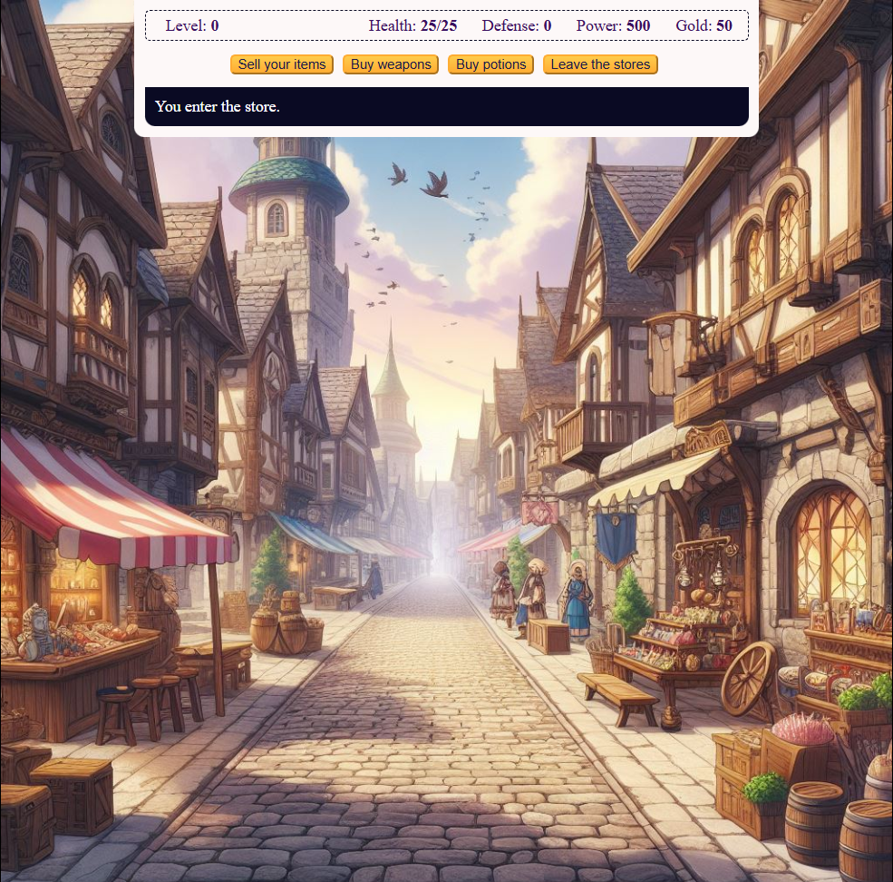

# 🐉 Game - Kings Quest - Jogo em JavaScript

## 🎮 Jogue agora

👉 [Clique aqui para jogar](https://game-kings-quest.vercel.app/)

---

## 📖 Sobre o projeto

Este é um jogo que desenvolvi para praticar meus conhecimentos em **JavaScript**.  
A ideia surgiu a partir de um dos exercícios do site [freeCodeCamp](https://www.freecodecamp.org/), mas resolvi expandi-la com uma história, mecânicas e refatorações próprias.

Gostei bastante de fazer esse projeto, pois ele representou um verdadeiro desafio que me ajudou a consolidar diversos conceitos. Volta e meia retorno a este código para refatorar e avaliar o quanto evoluí na minha jornada como desenvolvedor.

---

## 🧙 Sobre o jogo

Na história, você é visto como um herói pelos habitantes de um mundo misterioso e medieval para o qual foi **teletransportado**.

Esse mundo é habitado por criaturas mágicas perigosas — goblins, bestas e outras ameaças sombrias. Seu objetivo final é derrotar o **Dragão Celestial**, uma entidade de poder devastador.

Mas antes disso, você precisa se fortalecer:  
⚔️ Explorar masmorras profundas,  
💀 Derrotar monstros perigosos,  
🗡️ E encontrar a lendária **Hero Sword**, a única arma capaz de vencer o dragão.

---

## 🎮 Como jogar

- O jogo é controlado por botões que mudam de ação conforme o contexto da história.
- Você não controla diretamente o personagem, mas **toma decisões importantes** durante a aventura.
- A imagem de fundo muda de acordo com a situação: batalhas, lojas, exploração e muito mais.

---

## 💡 Funcionalidades

- Sistema de combate com inimigos variados
- Loja para compra de armas
- Sistema de defesa e poções
- Progressão baseada em monstros derrotados
- Imagens dinâmicas que acompanham os eventos do jogo

---

## 🛠️ Tecnologias usadas

- JavaScript (puro)
- HTML
- CSS

---

## 📌 Objetivos do projeto

- Praticar lógica de programação com JavaScript
- Refatorar código com boas práticas (ex: princípios SOLID)
- Criar uma narrativa interativa usando apenas tecnologias web

---

## 📷 Imagens

---

## 🚧 Em constante evolução

Este projeto continua recebendo melhorias e refatorações. Meu objetivo é sempre olhar para trás, identificar o que pode ser melhorado e aplicar novos aprendizados com o tempo.

---